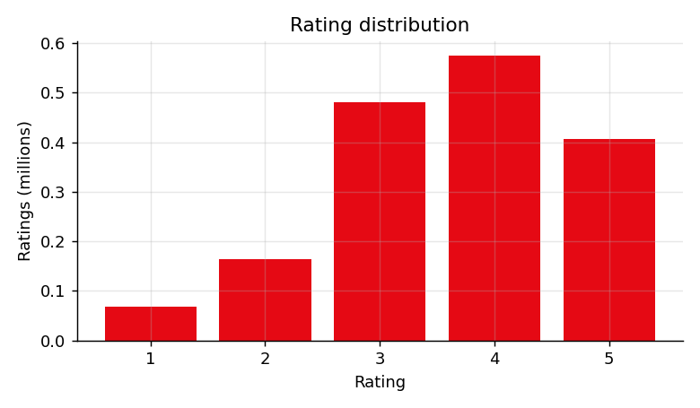
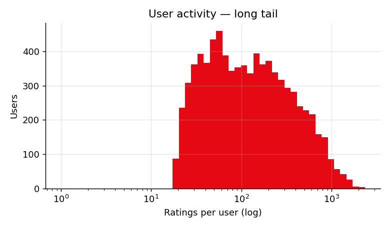
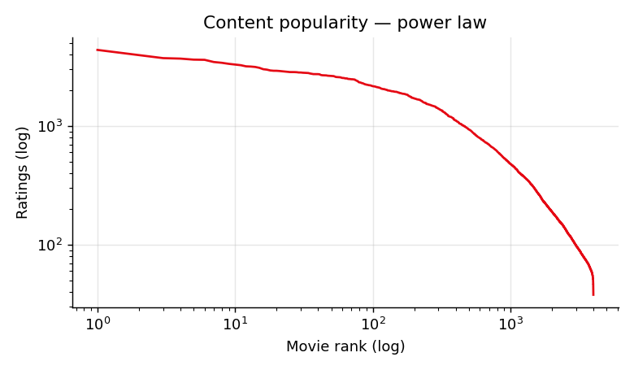
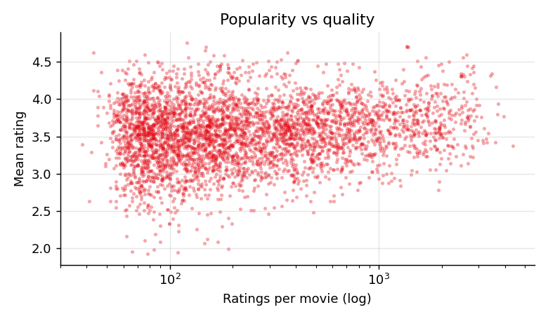
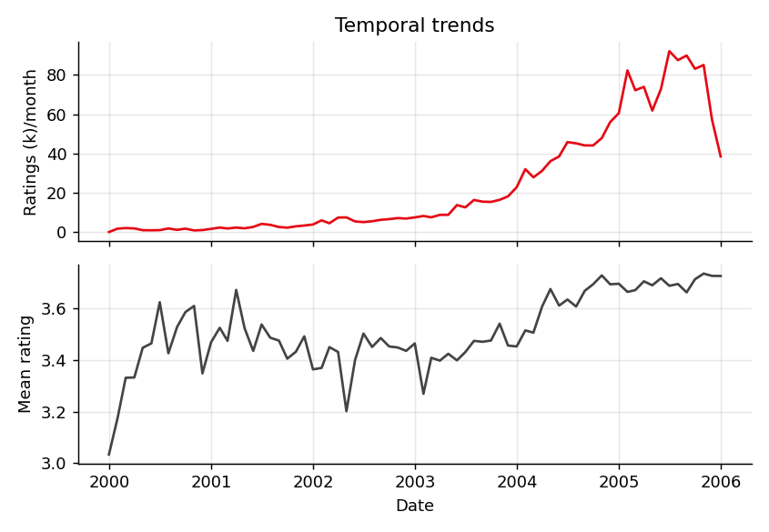

# Personalized Content Discovery on the Netflix Prize Dataset
**Technical Report — Recommendation Systems Challenge**

---

## 1. Problem Understanding

Streaming platforms live or die by content discovery: with tens of thousands of titles and users who rate barely 1% of them, the catalog a user actually sees is the catalog the recommender chooses to show.

The task is to learn user preferences from 100M historical ratings (1–5 stars) in the Netflix Prize dataset and (a) predict ratings for unseen movies, and (b) rank a personalized Top-10 for each user. These are related but distinct goals — a model can predict ratings accurately yet rank poorly — so we evaluate both: RMSE/MAE for prediction accuracy and MAP@10 (relevance = held-out rating ≥ 3.5) for ranking quality, plus Precision/Recall@10, NDCG@10, and catalog coverage.

We deliberately follow the competition guideline that a simple, well-understood model with strong analysis beats an opaque complex one: we compare a bias baseline, item-based collaborative filtering (interpretable, powers explanations), and SGD matrix factorization (FunkSVD) — the technique that defined the original Netflix Prize.

---

## 2. Data and Exploratory Analysis

The full dataset holds 100,480,507 ratings from 480,189 users on 17,770 movies (1999–2005), with matrix density of only 1.18%. We parsed all four raw files, then ran experiments on a reproducible subsample (seed 42): the 4,000 most-rated movies × 8,000 random users having ≥ 20 ratings, giving 1,695,940 ratings at 5.3% density. This preserves the long-tail shape while letting every experiment run in minutes.

| Statistic | Full dataset | Experiment sample |
|---|---|---|
| Ratings | 100,480,507 | 1,695,940 |
| Users / Movies | 480,189 / 17,770 | 8,000 / 4,000 |
| Density | 1.18% | 5.3% |
| Mean rating | 3.60 | 3.64 |
| Median ratings per user | 96 | 111 |
| Ratings share of top 10% movies | 76.6% | 43.7% |

### Key Findings

**Ratings skew positive.** 57% of all ratings are 4–5 stars and only 14.7% are 1–2. Users self-select movies they expect to like, so observed ratings are not a random sample — a key reason rating prediction alone overstates recommendation quality.

**Activity is extremely long-tailed.** The median user rated 96 movies but the most active rated 17,653; the mean (209) is more than double the median. Models must work for the quiet majority, not just power users.

**Popularity follows a power law.** The top 10% of movies absorb 76.6% of all ratings. Naive popularity ranking buries the catalog's long tail, so we track catalog coverage alongside accuracy. Popularity and quality correlate only weakly (r = 0.16 between log-popularity and mean rating), so "most watched" is not "best matched".

**Ratings drift upward over time** (mean 3.41 in the first year vs 3.70 in the last), reflecting Netflix interface changes and catalog growth — a reason to split train/test by time rather than randomly.

### EDA Figures

---

## 3. Methodology

### 3.1 Train/Test Split

Per-user temporal split: each user's ratings are sorted by date and the most recent 20% are held out for testing (users with fewer than 5 ratings stay fully in train; test movies never seen in training are dropped as unrateable). This mirrors production reality — predicting a user's future taste from their past — and is stricter than a random split, which leaks future behavior into training.

Result: **1,359,913 train / 336,027 test ratings.**

### 3.2 Models

**Bias Baseline.** `r(u,i) = μ + b_u + b_i` with regularized user/item biases (λ = 10). No personalization beyond "this user is generous, this movie is good". It anchors the comparison: anything fancier must beat it to justify its complexity.

**Item-based CF.** Adjusted-cosine similarity between item vectors after subtracting each user's mean rating, with significance shrinkage (factor n/(n+100) on co-rating count n, minimum overlap 3). Prediction is the similarity-weighted average of the user's own ratings over the k=40 most similar co-rated items, falling back to the bias baseline when neighbors are missing. Chosen for interpretability: the neighbors are the explanation (*"because you rated The Godfather 5/5"*).

**Matrix Factorization (FunkSVD).** `r(u,i) = μ + b_u + b_i + p_u · q_i` with 50 latent factors, trained by SGD (25 epochs, lr=0.007, L2 reg=0.05, numba-accelerated). Latent factors capture taste dimensions (genre affinity, tone, era) directly from co-rating structure — the workhorse of the original Netflix Prize. Factor count was validated on the held-out set: k=20 gave RMSE 0.8654 vs 0.8627 for k=50, which we retained.

### 3.3 Top-10 Generation and MAP@10 Procedure

For each evaluated user, the candidate set is every movie in the training catalog the user has not rated in train (~4,000 minus their history). The model scores all candidates; the 10 highest form the recommendation list. A held-out movie is relevant if its actual rating ≥ 3.5 (i.e. 4–5 stars).

MAP@10 = mean over users (with ≥ 1 relevant held-out item) of average precision: `AP = Σ P(k)·rel(k) / min(|relevant|, 10)`. Ranking metrics use 2,000 randomly sampled eligible users (seed 42) for tractability; RMSE/MAE use all 336,027 held-out ratings.

---

## 4. Experimental Results

| Model | RMSE | MAE | MAP@10 | NDCG@10 | P@10 | R@10 | Coverage | Fit (s) |
|---|---|---|---|---|---|---|---|---|
| Bias baseline | 0.9165 | 0.7168 | 0.0306 | 0.058 | 0.050 | 0.017 | 7.8% | 0.1 |
| Item-based CF | 0.8972 | 0.6940 | **0.0363** | **0.073** | **0.066** | **0.024** | **67.3%** | 5.1 |
| SVD (k=50) | **0.8627** | **0.6694** | 0.0196 | 0.044 | 0.044 | 0.016 | 15.7% | 34.5 |

### Discussion: Accuracy vs Ranking — The Central Trade-off

SVD wins rating prediction (RMSE 0.863, a 5.9% improvement over the baseline — for context, the original Netflix Prize awarded $1M for a 10% improvement over Cinematch). Item-CF wins ranking (MAP@10 0.036, +19% over baseline, +85% over SVD) and recommends from 67% of the catalog versus SVD's 16%.

**The model that predicts ratings best is the worst ranker** — a well-documented phenomenon: optimizing squared error concentrates probability mass on safe, high-bias items, while item-CF's neighborhood structure surfaces items tightly coupled to what the user demonstrably loved.

**Practical reading.** Bias baseline: trivially cheap, surprisingly close on RMSE — the honest floor. Item-CF: best ranking quality, best coverage, native explanations; similarity matrix is O(m²) memory, manageable at 4k items, harder at 17.7k+. SVD: best accuracy and compact (50-dim embeddings enable fast dot-product serving and ANN retrieval at scale), but needs ranking-aware training (e.g. BPR) to rank well. A production system would use a hybrid: SVD-style retrieval scored together with neighborhood evidence and a popularity prior.

---

## 5. Recommendation Examples and Analysis

### Success Case — Heavy Rater (1,336 train ratings)

**Training profile:** Clerks, Star Wars V, Star Wars IV, Monty Python's Flying Circus, Monty Python: The Life of Python.

| # | Recommended Title | Score | Because the user loved… |
|---|---|---|---|
| 1 | Dead Like Me: Season 2 | 4.27 | The Silence of the Lambs (rated 4/5) |
| 2 | The Sopranos: Season 2 | 4.22 | The Godfather (rated 5/5) |
| 3 | The Sopranos: Season 5 | 4.21 | The Godfather (rated 5/5) |
| 4 | LotR: The Two Towers Extended | 4.17 | LotR: Fellowship (rated 5/5) |
| 5 | Seinfeld: Season 4 | 4.17 | Star Wars: Episode V (rated 5/5) |

A Monty Python / Star Wars / Godfather fan receives The Sopranos seasons, Seinfeld, and LotR Extended Editions — quality drama and cult comedy precisely matching the profile, with sensible explanations. Several held-out favorites (Shawshank, Lost in Translation) confirm strong taste alignment.

### Success Case — Median User (89 train ratings)

**Training profile:** Like Water for Chocolate, Something's Gotta Give, Road to Perdition, Cold Mountain, In the Realm of the Senses.

| # | Recommended Title | Score | Because the user loved… |
|---|---|---|---|
| 1 | Curb Your Enthusiasm: Season 4 | 4.61 | Forrest Gump (rated 5/5) |
| 2 | Six Feet Under: Season 3 | 4.48 | The Silence of the Lambs (rated 4/5) |
| 3 | The West Wing: Season 1 | 4.47 | The Silence of the Lambs (rated 4/5) |
| 4 | Six Feet Under: Season 2 | 4.46 | The Silence of the Lambs (rated 4/5) |
| 5 | American Beauty | 4.44 | The Silence of the Lambs (rated 4/5) |

A viewer of adult dramas gets American Beauty, The Godfather, One Flew Over the Cuckoo's Nest, and Six Feet Under — tonally on-target prestige content. Their actual held-out watches (Sideways, Closer, Garden State) sit in the same register.

### Failure Case — Light User (25 train ratings)

**Training profile:** Something's Gotta Give, Independence Day, The American President, Raiders of the Lost Ark, Big Fish.

| # | Recommended Title | Score | Because the user loved… |
|---|---|---|---|
| 1 | The Sopranos: Season 2 | 4.58 | Raiders of the Lost Ark (rated 4/5) |
| 2 | Dead Like Me: Season 2 | 4.57 | The Sixth Sense (rated 4/5) |
| 3 | The Shield: Season 3 | 4.54 | The Sixth Sense (rated 4/5) |
| 4 | Lost: Season 1 | 4.50 | Men in Black (rated 4/5) |
| 5 | The Shawshank Redemption: Special Edition | 4.50 | The Sixth Sense (rated 4/5) |

With little history, recommendations collapse toward globally high-bias items (Sopranos, Lost, Shawshank) barely connected to the user's mainstream-blockbuster profile. Their actual held-out watches — Schindler's List, Indiana Jones 3, Harry Potter — show the system missed clear franchise signals. This is the **cold-start problem in miniature**, and the strongest argument for the hybrid/content-features approach discussed below.

---

## 6. Explainable Recommendations

Every recommendation ships with a reason derived from item-CF neighbor structure: the user's own highly-rated movies most similar to the recommended title. Example: *"The Sopranos: Season 2 — because you rated The Godfather 5/5 and The Silence of the Lambs 4/5"*.

Explanations cost nothing extra (similarities are already computed), increase user trust, and give product teams a debugging window into why the model recommends what it does.

---

## 7. Cold-Start Strategy

**New users:** recommend a popularity-quality blend (high mean rating with sufficient support), and onboard with a short "rate these diverse anchors" flow — a handful of ratings already moves a user from the failure case toward the median case.

**New items:** no interactions means CF is blind; bootstrap from metadata (year, genre, cast) via content similarity to known items, then blend in CF as ratings arrive.

**Sparse histories:** back off gracefully — ItemCF already falls back to the bias baseline when neighborhoods are empty; an interpolation weight on history length would formalize the blend. The light-user failure case in §5 quantifies exactly why this matters.

---

## 8. Key Insights

1. **Rating accuracy and ranking quality are different objectives** — the best RMSE model ranked worst; teams optimizing only RMSE would ship the wrong model.
2. **Coverage matters:** item-CF explored 67% of the catalog at equal-or-better precision; the baseline recycled the same 8%.
3. **Failure is predictable from data volume:** recommendation quality degrades smoothly with history length, arguing for explicit history-aware blending.
4. **Simple models are competitive:** two regularized bias terms achieve RMSE 0.92; every engineering hour after that buys a few hundredths of RMSE — spend those hours on ranking, coverage, and explanations instead.
5. **Temporal effects are real** (rating inflation 3.41 → 3.70), so temporal validation is not optional rigor — random splits would overstate performance.

---

## 9. Future Improvements

- Ranking-aware training (BPR / WARP loss) to close SVD's MAP gap
- Implicit-feedback signals (SVD++)
- Time-aware factors (timeSVD++) to model the observed drift
- A hybrid content+CF model using title/year metadata for cold items
- Diversity-aware re-ranking (MMR) on the Top-10
- Full-dataset training with ALS on Spark
- Online evaluation — offline MAP@10 is a proxy; only an interleaved A/B test measures true engagement
